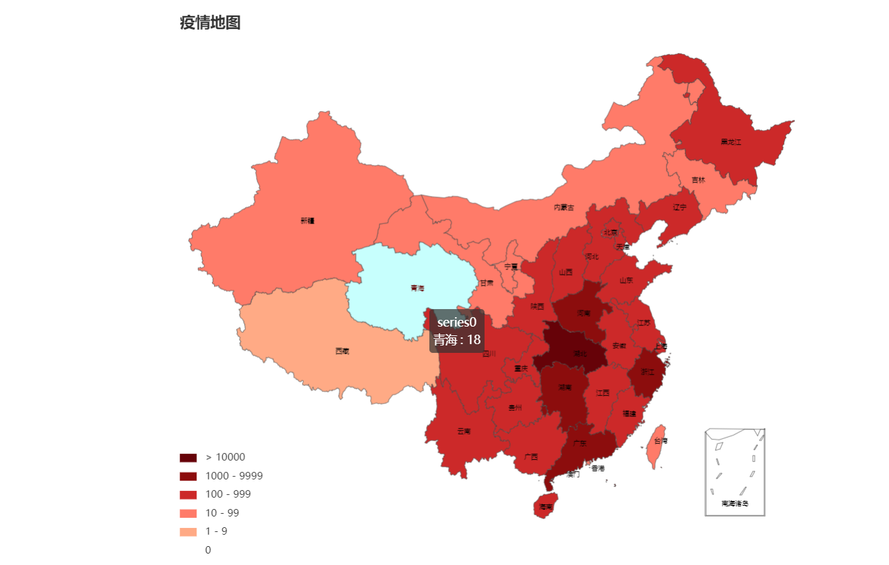

# mymap

## Project setup
```
npm install
```

### Compiles and hot-reloads for development
```
npm serve
```

### Compiles and minifies for production
```
npm run build
```

### 项目接口-疫情实时动态接口数据源于新浪
```

.接口路径：components\HelloWorld.vue
```

### 效果展示

